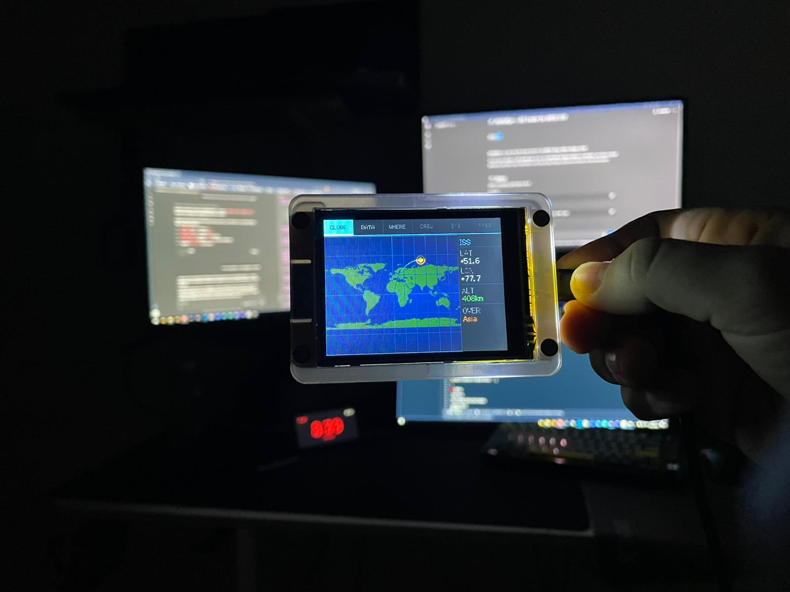
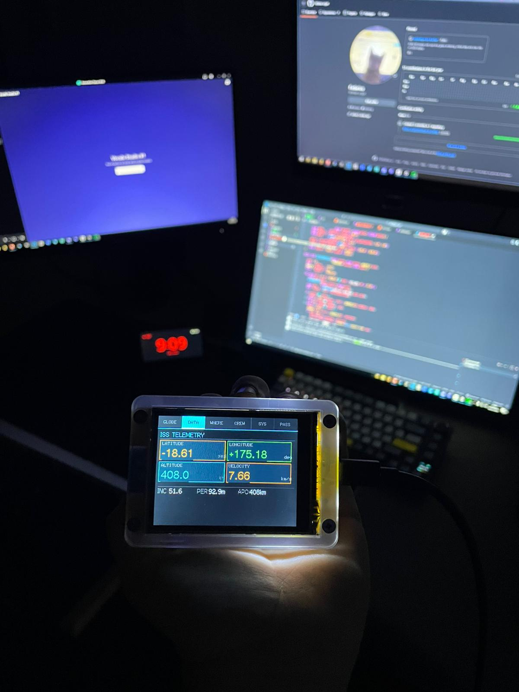

# 🛰️ OrbitalEye — ISS Tracker for ESP32 CYD

OrbitalEye is a real-time ISS tracker built for the **ESP32 Cheap Yellow Display (CYD)**.

The firmware displays a **2D world map**, tracks the **International Space Station in real time**, and shows orbital telemetry, astronaut crew information and upcoming ISS pass predictions directly on the touchscreen.

---

## 📷 Demo

---

## ✨ Features

- 🗺 **2D world map display**
- 🛰 **Real-time ISS position tracking**

### 📡 Orbital telemetry

- latitude  
- longitude  
- altitude  
- velocity  

### 👨‍🚀 Astronaut crew

Displays the astronauts currently aboard the **International Space Station**.

### ⏱ ISS pass predictions

Predicts upcoming **visible ISS passes** for the configured location.

### 📶 System information

Displays:

- WiFi signal strength  
- system uptime  
- connection status  

---

## 🧰 Hardware

Target board:

**ESP32-2432S028R (Cheap Yellow Display)**

| Component | Details |
|-----------|--------|
| MCU | ESP32 |
| Display | ILI9341 320×240 TFT |
| Touch | XPT2046 |
| Connectivity | WiFi |

---

## 🧠 Firmware Architecture

| File | Description |
|-----|-------------|
| `main.cpp` | Main firmware logic |
| `ui.h` | UI rendering |
| `globe_renderer.h` | Map rendering engine |
| `globe_data.h` | World map data |
| `Worldmap.h` | Map projection |
| `Calibration.h` | Touch calibration |
| `config.h` | Hardware configuration |

---

## 🧠 Tech Stack

- PlatformIO  
- Arduino framework  
- TFT_eSPI  
- WiFi networking  
- ArduinoJson  

---

## 📡 APIs Used

ISS live position  
http://api.open-notify.org/iss-now.json

Astronaut crew data  
http://api.open-notify.org/astros.json

ISS pass predictions  
http://api.n2yo.com

---

## ⚙️ Setup

Clone the repository:
git clone https://github.com/Winter-crypt/orbitaleye-iss-tracker.git

Open the project in **PlatformIO**.

Edit:
src/config.h
Insert your WiFi credentials:
#define WIFI_SSID "YOUR_WIFI"
#define WIFI_PASSWORD "YOUR_PASSWORD"
(Optional) insert your N2YO API key:
#define N2YO_API_KEY "YOUR_N2YO_API_KEY"

Upload the firmware to the CYD board.

---

## 🚀 Versions

| Version | Hardware |
|--------|--------|
| v1 | ESP32 + OLED display |
| v2 | ESP32 CYD (ILI9341 touchscreen) |

The original implementation is available in the **`v1` branch**.

---

## 📜 License

MIT License
